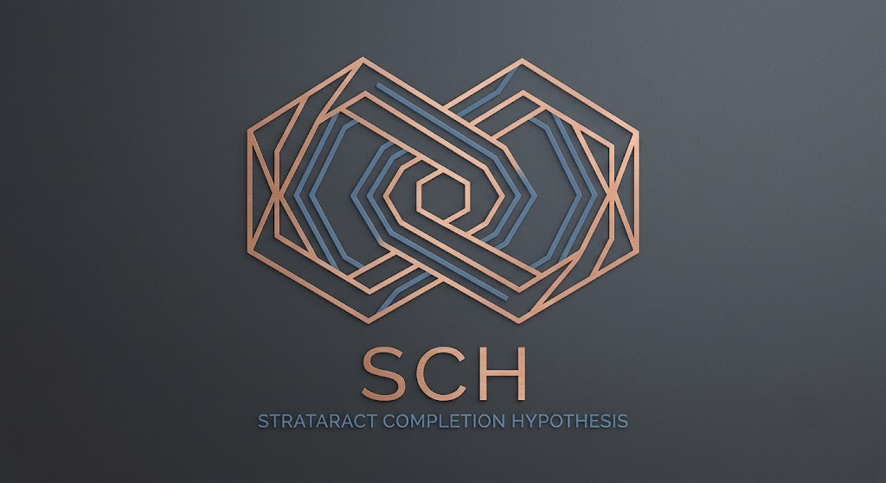

  

# The Strataract Completion Hypothesis (SCH)

The **Strataract Completion Hypothesis (SCH)** is a speculative theoretical-physics framework that explores the possibility that gravity has a second source beyond conventional mass-energy: the **geometric organizational state** of matter.

SCH is built from a closed Einstein-Cartan-Dirac action with a quartic spinor self-coupling. Within that framework it develops a unified geometric picture in which elementary particles are modeled as topological solitons, rest mass is associated with rotational structure in an additional spatial degree of freedom ("w-spin"), and large-scale gravitational phenomena emerge from gradients in an underlying organizational field rather than from spacetime curvature alone.

The framework spans particle physics, gravitation, cosmology, and galactic dynamics. Its central objective is not to reproduce any single observation in isolation, but to derive a coherent set of predictions from one frozen variational principle and test those predictions against independent observations.

**SCH is an active research hypothesis, not an established physical theory.** The purpose of this repository is to document that research transparently: preserving successful derivations, unresolved questions, failed approaches, and historical revisions rather than presenting only final results.

---

# Current Project Status

The repository is governed by **Governance Charter v3** and the methodology documents in `01-Governance/` and `02-Methodology/`.

The current reconstruction and project-wide audit have produced several important conclusions:

* The repository's governance, reconstruction, and canonical-theory architecture has been established and independently audited.
* The majority of Appendix P's mechanism-level mathematical claims survive reconstruction without requiring revision.
* The principal recurring unresolved issue is not disagreement between derivations, but the documented provenance of several effective-potential constructions that are stated as originating from the frozen action without a complete intermediate derivation presently recorded.
* Several quantitative sectors remain intentionally parameter-dependent pending experimental calibration, most notably the proposed **Bi-209** measurement that determines the framework's coupling constant.
* Open questions remain explicitly classified and are no longer mixed with established derivations.

The project therefore distinguishes clearly between:

* **Established mathematical results**
* **Construction-scoped results**
* **Conditional claims with documented dependencies**
* **Open research questions**
* **Historical or superseded work**

The repository's status is determined by documented methodology rather than editorial judgment.

---

# Repository Organization

The repository is organized by **authority and function**, not by scientific topic.

| Directory              | Purpose                                                                                                                                                          |
| ---------------------- | ---------------------------------------------------------------------------------------------------------------------------------------------------------------- |
| `01-Governance/`       | Repository governance, project rules, authority map, and promotion criteria.                                                                                     |
| `02-Methodology/`      | Documentation standards, claim classification framework, scope rules, reproducibility requirements, and audit methodology.                                       |
| `03-Reconstruction/`   | Reconstruction reports, audit reports, derivational recovery, and verification work. Reconstruction documents analyze the canonical corpus without modifying it. |
| `04-Canonical-Theory/` | The current citable statement of SCH: Papers A–C, Appendix P, formal derivations, and canonical theory documents.                                                |
| `05-Alternatives/`     | Alternative constructions, competing approaches, or proposed replacements that are intentionally separated from canonical theory until independently justified.  |
| `06-Support/`          | Computational tools, replication studies, analysis pipelines, datasets, and supporting material.                                                                 |
| `07-Superseded/`       | Historical versions of documents retained unchanged to preserve provenance and auditability.                                                                     |

This structure reflects the project's central design principle:

> **Methodology defines how claims are evaluated. Reconstruction determines what the existing corpus actually establishes. Canonical theory records only the current accepted framework.**

---

# Reading Order

For readers new to the project, the recommended order is:

1. Governance Charter (`01-Governance/`)
2. Methodology (`02-Methodology/`)
3. Paper A
4. Appendix P
5. Papers B and C
6. Reconstruction reports (for derivational provenance and audit findings)

Reading the methodology before the theory is intentional. The repository is designed so that every scientific claim can be interpreted within an explicit framework of documentation, scope, reproducibility, and evidence.

---

# Project Philosophy

SCH is maintained as an auditable scientific research project rather than a collection of static papers.

Several principles guide development:

* Every mathematical claim is expected to have a documented derivation chain.
* Scope limitations are explicit and are never enlarged by implication.
* Independent reproduction is preferred before a result is promoted as established.
* Alternative constructions remain separate from canonical theory until independently justified.
* Historical documents are retained rather than rewritten, preserving the project's complete provenance.

The goal is not to eliminate mistakes from the historical record, but to make them visible, traceable, and scientifically useful.

---

# Current Stage of Development

Following the completion of the fermion-sector reconstruction and the first project-wide audit, the repository has transitioned from exploratory development toward systematic verification.

Current work focuses on:

* completing project-wide claim auditing,
* reconstructing remaining derivational sectors,
* strengthening effective-potential provenance,
* empirical comparison with observational data,
* experimental calibration of free parameters,
* and independent reproduction of canonical derivations.

As the repository evolves, governance, methodology, reconstruction, and canonical theory are updated independently so that scientific conclusions remain traceable to their documented derivations.

