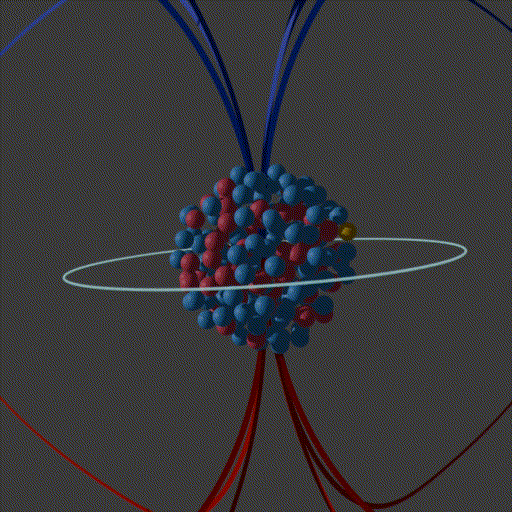

# The Strataract Completion Hypothesis

**A multi-scale gravitational framework derived from first principles, with falsifiable predictions from laboratory benchtops to cosmological surveys.**

*Erin Dunn — Working Paper Suite, May–June 2026*

---

## The Central Idea

Einstein's field equations are extraordinarily successful. They describe gravity as the curvature of spacetime produced by mass and energy. But they encode only *what* matter is — its mass, its energy, its momentum — not *how* it is organized.

This framework proposes that the geometric organizational state of matter constitutes an independent gravitational source variable. A galaxy whose stars orbit in coherent, organized rotation produces more gravitational effect than an identical mass of stars orbiting randomly. Not because of hidden particles. Not because the law of gravity is different. Because rotation, at a fundamental level, is not just something matter *does* — it is something matter *is*.

That single idea, taken seriously and derived rigorously from an action principle, turns out to have consequences from the scale of atomic nuclei to the scale of the observable universe.

---

## Why Rotation?

The framework is built from one primitive: **rotation is fundamental**.

Not rotation as a phenomenon that emerges at some energy scale. Not rotation as a secondary property of matter. Rotation as the bedrock geometric property of spacetime — present before particles, before fields, before spacetime had content.

The minimal mathematical object that encodes rotational state in curved spacetime is a spinor field. The condensate ground state of that spinor field turns out to source gravity in a way that standard General Relativity does not account for. Everything else in this framework follows from that starting point.

The modified field equation is:

$$G_{\mu\nu} + \Lambda g_{\mu\nu} = \kappa \left[ T_{\mu\nu} + \alpha C_{\mu\nu} \right]$$

where $C_{\mu\nu} = \rho\, \eta\, u_\mu u_\nu$ is the geometric state tensor encoding rotational organizational state, $\eta = \bar{\psi}\psi$ is a Lorentz scalar derived from the spinor field, and $\alpha$ is a dimensionless coupling constant to be fixed by experiment. General Relativity is recovered exactly when the axial current $A^\mu = 0$ — the isotropic, non-rotating ground state.

---

## What It Explains

The framework addresses a cluster of observational anomalies that individually have partial explanations but collectively point at something missing from the standard picture.

**Galactic rotation curves.** Stars at the outer edges of spiral galaxies orbit far faster than the visible mass predicts. The standard response is to invoke dark matter halos. This framework proposes instead that the coherent rotational organization of the galaxy itself contributes additional gravitational sourcing — and that the effect should be strongest in the most coherently rotating systems.

**The morphology–lensing correlation.** Rounder, more isotropic elliptical galaxies show stronger gravitational lensing than elongated ones of equal mass. Particle dark matter has no mechanism to produce this: dark matter tracks mass, not shape. Geometric organizational state does.

**The Bullet Cluster.** The lensing signal follows the galaxies, not the gas, through a high-speed cluster collision. This framework explains it as *geometric stripping*: the shock-heated gas loses its organizational coherence instantly, while the stellar matter retains its rotational structure and continues sourcing the geometric field.

**JWST early massive galaxies.** The James Webb Space Telescope is finding galaxies at redshifts $z \sim 10$–16 that are too massive, too compact, and formed too early relative to standard cosmological predictions. The framework addresses this through a bounce cosmology mechanism in which each prior cosmic cycle deposits additional net baryonic matter into the next cycle's initial conditions.

**CMB large-angle anomalies.** The observed suppression of CMB power at the largest angular scales ($\ell = 2, 3$) has no natural explanation in a flat universe. The $\mathrm{SU}(2) \times \mathrm{SU}(2)$ covering group of the spinor field identifies $S^3$ (the three-sphere) as the natural spatial topology — which introduces a topological cutoff on the power spectrum at exactly the observed scale.

---

## The Bismuth-209 Experiment

The most grounding feature of this framework is that it makes a specific, tabletop laboratory prediction.

Bismuth-209 has the largest nuclear magnetic moment of any stable nucleus. Lead-208 is doubly magic — the most geometrically symmetric stable nucleus, with a magnetic moment of essentially zero. Proton bombardment drives the transmutation Bi-209 → Pb-208, collapsing nuclear spin from $I = 9/2$ to $I = 0$. Under this framework, that transition is the maximum-contrast geometric reorganization available in stable matter.

   Pb208">

Three independent measurement channels are specified:

| Channel | What is measured | SM prediction | SCH prediction |
|---------|-----------------|---------------|----------------|
| **A** — Near-field photon deflection | Angular deviation of a laser beam through the interaction region, coincidence-triggered on individual transmutation events | Zero deviation | Measurable angular deflection $\propto \alpha$ |
| **B** — Calorimetric anomaly | Energy balance during bombardment | Heat = deposited beam energy | Anomalous calorimetric deficit at the transition moment |
| **C** — Torsion timing signature | Coincidence timing between the spin collapse and the calorimetric signal | Smooth thermal profile | Sharp spike at the spin transition, temporally distinct from Channel B |

This experiment fixes the free parameter $\alpha$ and the effective condensate mass $m_\text{eff}$. Every quantitative prediction in the framework — from galaxy rotation curves to the NANOGrav frequency band — chains through this single calibration.

If Channels A, B, and C all return null results at sufficient sensitivity, the framework's coupling to nuclear matter is falsified at the relevant scale.

---

## The Formal Structure

This is not a phenomenological patch on General Relativity. The framework is derived from the Einstein–Cartan–Dirac action with a quartic spinor self-coupling:

$$S_{\text{geo}} = \int d^4x\, e \left[ \frac{i}{2}\left(\bar{\psi}\gamma^a e^{\mu}_a D_\mu \psi - \text{h.c.}\right) - m\bar{\psi}\psi - \frac{\lambda}{4}(\bar{\psi}\psi)^2 \right]$$

Four theorems establish the closed variational structure:

- **Theorem 1** — $Q_{\mu\nu} = \rho\,\eta\,u_\mu u_\nu$ is the *unique* rank-2 symmetric divergence-free tensor constructible from the spinor bilinears at quadratic order, given the symmetries of the action.
- **Theorem 2** — The coupling efficiency $\eta = \bar{\psi}\psi$ is a Lorentz scalar. The four-velocity $u^\mu = J^\mu / (\bar{\psi}\psi)$ satisfies $u^\mu u_\mu = -c^2$ in the parity-preserving vacuum sector.
- **Theorem 3** — The decoherence and recoherence rates $\Gamma_\text{decoh}$ and $\Gamma_\text{recoh}$ are derived from the finite-temperature effective potential via the Matsubara formalism. No free parameters remain.
- **Theorem 4** — The condensate $C_{\mu\nu}$ is a propagating field (Term 2) governed by the Dirac equation; torsion (Term 3) is a contact interaction algebraically determined by the Cartan equation. These are physically and observationally distinct.

General Relativity is recovered *exactly* as the torsion-free limit. This is not an approximation.

---

## How to Falsify This

This framework is built to be killed. The following are the primary falsification conditions, organized by scale.

### Laboratory scale
| Test | What would falsify SCH |
|------|----------------------|
| Bi-209 → Pb-208 transmutation (Channels A, B, C) | All three channels return null results at sensitivity sufficient to detect the predicted coupling $\alpha$ |

### Galactic scale
| Test | What would falsify SCH |
|------|----------------------|
| MaNGA × DES: $\lambda_R$ vs. weak lensing at fixed stellar mass | No statistically significant monotonic dependence of lensing on rotational coherence after mass controls |
| SLACS: metallicity vs. Einstein radius at fixed total mass | No positive residual correlation between metallicity and Einstein radius in the thermally controlled sample |

### Cosmological scale
| Test | What would falsify SCH |
|------|----------------------|
| $S^3$ standard ruler test (JWST/Roman) | Monotonically decreasing angular size with redshift at all observed $z$, with no improvement of the $S^3$ fit over the flat-universe fit |
| Antipodal CMB correlation (existing Planck data) | No statistically significant positive correlation between antipodal sky pixel pairs $T(\hat{n}) \times T(-\hat{n})$ above the $\Lambda$CDM baseline |

### Particle scale (Paper C)
| Test | What would falsify SCH |
|------|----------------------|
| B-meson tau channel: $B \to K^* \tau^+ \tau^-$ | Tau/muon anomaly ratio significantly different from $m_\tau / m_\mu \approx 16.8$ |
| Hadronic angular observables in $B^0 \to K^{*0} \mu^+ \mu^-$ | Hadronic side deviates from Standard Model predictions (SCH predicts purely leptonic modification) |

The framework survives if and only if all of these tests return positive results in the predicted direction. A single robust null result at sufficient sensitivity is a genuine falsification.

---

## Open Proof Targets

Several theoretical claims are stated as predictions with outstanding formal proofs. This is an honest accounting, not a weakness. The algebraic structure of the theory points clearly in each direction; the formal calculations are identified targets.

| Target | Claim | Status |
|--------|-------|--------|
| **PT-1** | The antipodal map on $S^3$ acts as $-1$ on the spinor field through the bounce, inducing $A^\mu \to -A^\mu$ (chirality inversion, cyclic alternation) | Proof outstanding; CT-viii prerequisite |
| **PT-2** | Bogoliubov analysis of pair creation in chiral condensate background — quantitative rate for sympathetic nucleation | Calculational target identified |
| **CT-xiii** | Photon–condensate coupling cross section $\sigma(\omega)$; derivation of CMB monopole temperature from the condensate scrambling integral | Prerequisites: CT-vii + CT-viii |
| **CT-xiv** | Leptonic self-energy in the condensate background; establishes whether the condensate produces a mass-weighted modification of lepton propagation | First target of Paper C |

---

## The Paper Suite

This repository contains five documents comprising the working paper suite as of June 2026.

| Document | Description | Status |
|----------|-------------|--------|
| **[Paper A](papers/Paper_A_Draft_1_5.md)** — Draft 1.5 | Core framework: derivation, theorems, primary observational tests, Bi-209 experiment, cosmological extensions | Main paper |
| **[Paper B](papers/Paper_B_Draft_1_4.md)** — Draft 1.4 | Empirical evidence programme: MaNGA replication, Earth flyby consistency check, proposed tests, exploratory directions | Companion |
| **[Paper C](papers/Paper_C_Draft_1_2.md)** — Draft 1.2 | Particle-scale extension: B-meson angular anomaly, leptonic mass modification, nuclear scale survey | Companion |
| **[Appendix P](papers/SCH_Appendix_P_v7.md)** — v7 | Full formal proofs: all four theorems, conservation architecture, density hierarchy, calculational programme | Proof document |
<!-- | **[SCH Replication Study]** — Working Paper | Independent pipeline replication of the MaNGA rotational coherence staircase using JAM v2 and Firefly catalogues | Awaiting DES Y6 data | -->

---

## Current State

The framework is a working paper suite, not a published result. It is posted here in the spirit of open science: to invite scrutiny, to put predictions on record before the relevant measurements are made, and to make the falsification conditions explicit.

What is established: a closed variational theory with four formal theorems, a complete density hierarchy, regime-conditional claims throughout, and a clear parameter-fixing programme anchored to a tractable laboratory experiment.

What is open: several calculational targets, two formal proof targets, and the experimental programme itself. The Bi-209 calibration has not been run. The MaNGA–DES lensing cross-match has not been performed. The tau channel B-meson measurement is pending Belle II luminosity.

The predictions are on record. The tests are defined. The framework is ready to be falsified.

---

## Contact

*Erin Dunn*
*June 17, 2026*
